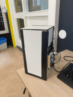
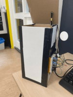

# Trash-Bin-Bot
By S. Schneider and V. Berkhout

Our assignment for our coding class.

Inspired by: https://projecthub.arduino.cc/ashraf_minhaj/c81effad-d583-40bb-9d20-808803efbdf2

# Components 
1. Cardboard + Tape (the more cardboard you use the bigger the trash can will be)
2. Arduino Uno
3. Breadboard
4. HCSR04 Ultrasound Sensor
5. Servo + Servo arm
6. Electric Wires


# Function
This arduino-contraption uses an ultrasound sensor to measure if anything is within 25 centimeters in front of it. When it sees that something is within those 25 centimeters, it will make the servo -which has an extension of cardboard taped onto it- turn up, which in turn will push the lid up. After 1 second, it will beep 3 times -each 0.25 seconds apart- and than close again.




# Extra
We also have a couple of extra things you could add to make it a bit more fun:
- When there is still something within 25 centimeters of the sensor when it is done with beeping, it will will wait one second, and then start beeping again. It will keep doing this until the object is gone. But what if this would annoy the bot? Make a counter that counts to 10 by adding 1 every time it beeps. When it hits 10, add another -higher pitched- note to the beeping.
- Utilising the same counter, you could also make it open and close in rapid pace until the object is gone. 
- You could also add a light that will light up when the trash-bin-bot opens its lid.

# Code

```
#include<Servo.h>
Servo servo; 
int const trigPin = 9;
int const echoPin = 5; 
int const note3 = 550;
int const note2 = 440;
int const note1 = 330;
int angry = 0;

void setup() 
{ 
pinMode(trigPin, OUTPUT);
pinMode(echoPin, INPUT);      
servo.attach(3); 
} 
void loop() 
{        
int duration, distance; 
digitalWrite(trigPin, HIGH);  
delay(1); 
digitalWrite(trigPin, LOW);
duration = pulseIn(echoPin, HIGH);
distance = (duration/2) / 29.1;
if (angry >= 10 && distance <= 25 && distance >= 0)
  {tone(8, 4000, 1000 ); delay(1000);
  angry = angry -1;
}
else if (distance <= 25 && distance >= 0)  
{//\t 
  //tone(8, note, 500); 
  servo.write(75);    delay(1000);
  tone(8, note1, 150); delay(250);
  tone(8, note2, 150); delay(250);
  tone(8, note3, 150); delay(250);
  angry = angry + 1; // oOo meer
}  
else  
{//\t\t
  servo.write(160);
  noTone(8);
  angry = 0;
}} 
```